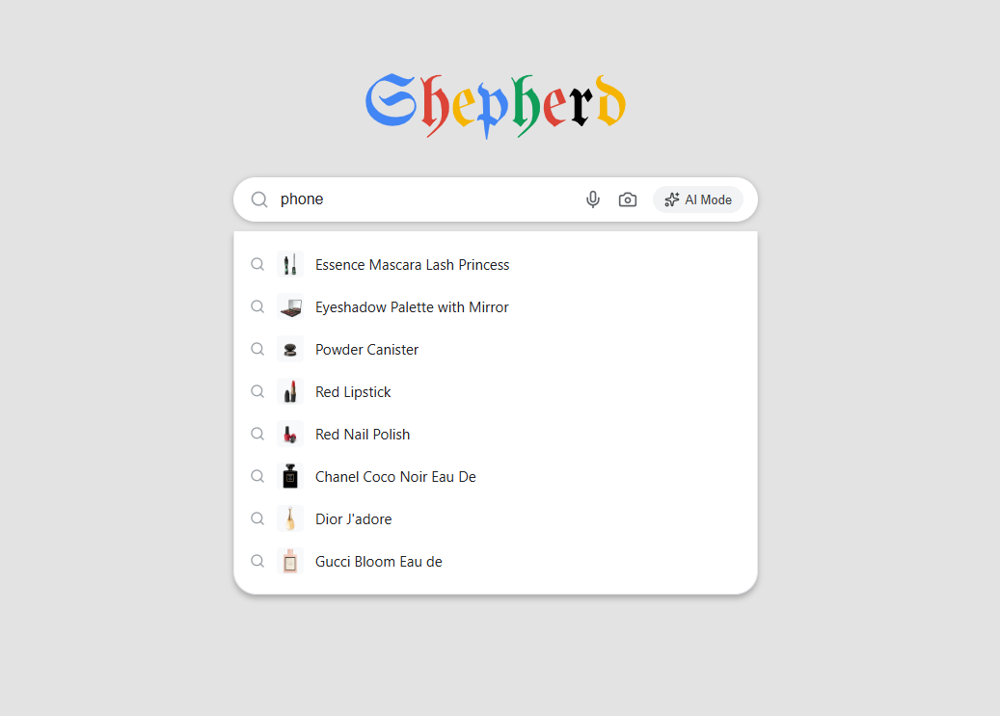

# Autocomple Search Bar (Google Clone)



A fast, highly interactive, state-driven search bar component featuring real-time autocomplete suggestions, keyboard navigation, and optimized query filtering built in React.

🔗 **[View Live Demo](https://your-autocomplete-link.netlify.app/)**

---

## 🚀 Features
* **Real-time Query Filtering:** Instantly filters lists of data as the user types.
* **Interactive Dropdown Suggestions:** Displays clear matches beneath the search input.
* **Keyboard Navigation Support:** Fully navigable using keyboard controls (Arrow Up, Arrow Down, and Enter keys) for an accessible experience.
* **Dismiss-on-Outside-Click:** Closes the suggestion box seamlessly when clicking anywhere outside the search interface.

## 🛠️ Tech Stack
* **Framework:** React 18+
* **Build Tool:** Vite
* **Styling:** CSS3 (modern layouts, custom list scrollbars, and hover state transitions)
* **Hosting:** Netlify (configured with redirect rules for clean routing)

---

## ⚛️ React Elements & Concepts in Use

This project utilizes core React features to build a responsive and highly interactive UI component:

* **State Management (`useState`):**
  * Tracks the active input query.
  * Manages the filtered list of matching suggestions.
  * Controls UI visibility (showing/hiding the suggestion dropdown).
  * Keeps track of the currently highlighted index during keyboard navigation.
* **Side Effects (`useEffect`):**
  * Listens for global mouse clicks to close the search dropdown when a click outside is detected.
  * Optionally manages query throttling or debouncing to optimize heavy search filtering.
* **Controlled Components:**
  * The search `<input />` is fully controlled by React state, ensuring that the visual value and active queries are perfectly synced.
* **Dynamic Style Classes:**
  * Uses conditional logic to apply active classes (e.g., `.active`, `.highlighted`) to list items as users hover or move through matches with keyboard keys.
* **List Rendering & Keys:**
  * Renders filtered datasets dynamically, utilizing unique and stable keys to optimize React's virtual DOM diffing process.

---

## 💻 How to Run Locally

Since this project utilizes React and Vite, you will need Node.js installed on your computer to run it:

1. **Clone the repository:**
   ```bash
   git clone [https://github.com/shepherd-bit/r03-autocomplete-input-search-bar.git](https://github.com/shepherd-bit/r03-autocomplete-input-search-bar.git)